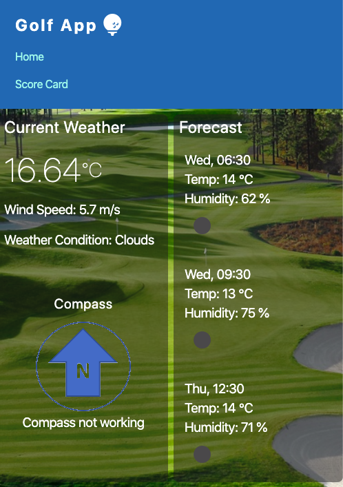
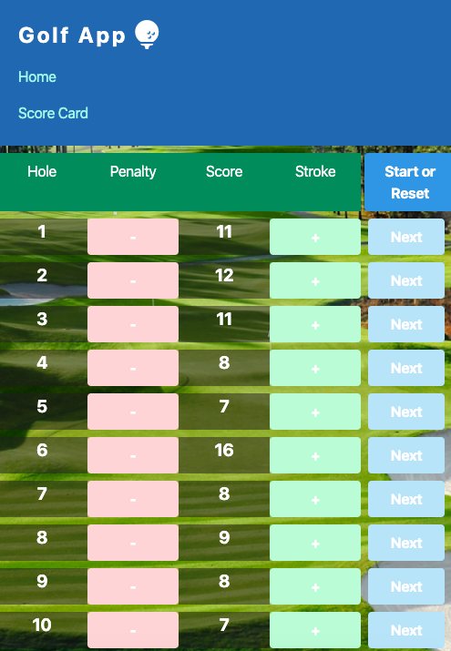

<h1>GolfApp</h1>

<h4>User's Story</h4>

I want to know if my game will be affected by the weather and the layout of the course.

I can use google map and weather app to look up this data, but now I have a new golfing app

When I arrive at the golf course, I open my app
<ul>
<ls>
Weather & forecast details at the location will showed up.
</ls>
<ls>
Then I click on a tab, the map of the course will be displayed.
</ls>
<ls>
Current wind speed and direction will also become available
</ls>
</ul>

Then I proceed to start my game

<ul>
<ls>
At the 1st hole, I clikc on a tab and a scorecard is displayed
</ls>
<ls>
If I incurred a penalty, I click on a button on my app and record the type of penalty. Score is stored on local storage
</ls>
<ls>
At the conclusion at a hole, I then click a button indicating moving on to the next hole.
</ls>
<ls>
Process continue until game completed at hole number 18.
</ls>
<ls>
Then my score is tally up and my performance at each hole and the game is displayed.
</ls>
</ul>
<a href='https://udara.github.io/after_one_of_Jupiter-s_moons/'>Golf App</a>

